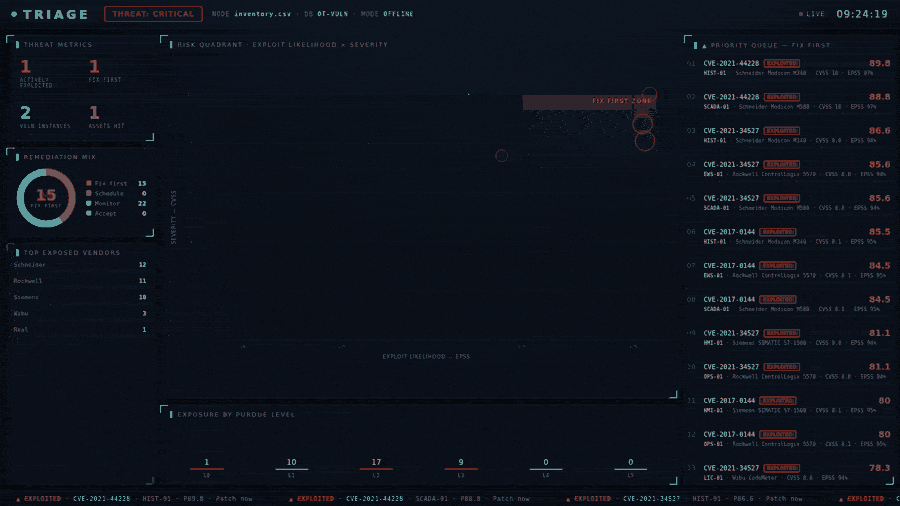
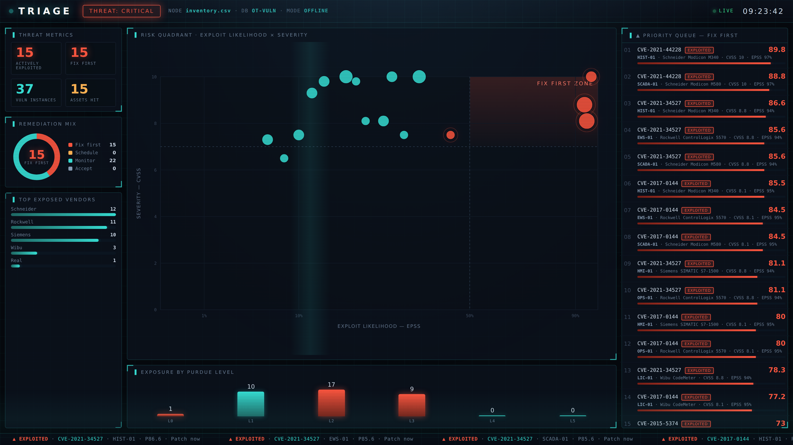

# Triage



**Ten thousand vulnerabilities, one honest answer: what do I patch first?** Triage scores an OT/ICS asset inventory against known vulnerabilities and ranks remediation by what actually matters — not just CVSS.

Every OT security program drowns in the same way. A scanner returns a wall of
CVEs, half of them CVSS 9-and-up, and none of them tells you where to start. CVSS
measures how bad a flaw *could* be; it says nothing about whether anyone is
exploiting it, how likely they are to, or whether the box even matters. Triage
folds all of that together and hands you a defensible "fix this first" list — the
thing a senior assessor produces that a raw scan never will.

## What makes it different

Triage blends five signals into one 0-100 priority per finding:

- **KEV** — is it on CISA's Known Exploited Vulnerabilities list? Being exploited
  *right now* is the single strongest reason to move.
- **EPSS** — FIRST's probability that a CVE will be exploited in the near term.
- **CVSS** — severity if it is exploited.
- **Asset criticality** — a nuisance HMI and a safety controller are not the same.
- **Exposure** — internet-facing and network position (the Purdue level).

Then it does the part that is unique to OT: it accepts that **you often cannot
patch**. A safety PLC with a CVSS 10 hardcoded-key flaw does not go to the top of
a "reboot and patch" queue — it goes to a **compensating-control** track:
segment, allow-list, monitor. Meanwhile the actively-exploited Log4Shell on the
Windows historian, which everyone's scanner buried at rank 400, comes first.

## Quickstart

```bash
pip install -r requirements.txt

# score the bundled demo inventory
python run.py scan samples/inventory.csv

# open the risk quadrant + fix-first list
python run.py dashboard --results triage_results.json   # -> http://localhost:3004
```

Bring your own inventory as a CSV (`id, vendor, model, firmware, role, zone,
purdue_level, criticality, internet_exposed, patchable, platform`) — the demo
generator in `scripts/make_demo_inventory.py` shows the format.

## The risk quadrant

The dashboard plots every CVE by **exploit likelihood (EPSS)** against **severity
(CVSS)**. The top-right corner — likely *and* severe — is the **fix-first zone**,
and anything actively exploited glows. It turns a spreadsheet of thousands into a
picture a manager understands in three seconds: the cluster in the red corner is
this week's work.

## Runs offline — built for air gaps

Triage ships with a bundled vulnerability snapshot and scores entirely offline, so
it works on an isolated OT network with no internet. When you *do* have a
connection, refresh the two feeds that move fastest:

```bash
python run.py update      # pulls current CISA KEV flags + FIRST EPSS scores
```

The bundled set uses real CVE IDs (Siemens, Schneider, Rockwell, plus the
cross-cutting Log4Shell / VxWorks / Windows issues that live on OT-connected
hosts) with representative scores; `update` makes them live.

## How the score is built



```
  per (asset, CVE):
     0.30 · actively-exploited (KEV)
   + 0.25 · exploit likelihood (EPSS)
   + 0.20 · severity (CVSS/10)
   + 0.15 · asset criticality
   + 0.10 · exposure
   ─────────────────────────────────  ×100  →  priority (0-100)
        │
        ▼
   band: fix-first / schedule / monitor / accept
        │
        ▼
   action, tuned by whether the asset is patchable
```

Every finding carries its factor breakdown, so the ranking is explainable — you
can show an asset owner exactly *why* something is first.

## Responsible use

Triage is a defensive prioritisation tool. It reads an inventory and public
vulnerability data; it does not scan, probe, or touch any device, and it contains
no exploit code. It exists to help defenders spend limited maintenance windows on
the right things.

## Roadmap

- Live NVD enrichment for CVEs beyond the bundled set
- Importers for common inventory formats and passive-discovery output
- Compensating-control mapping to IEC 62443 / NIST 800-82 controls
- Trend view: are we closing the fix-first zone over time?
- Export to CSV / PDF remediation plan for change tickets

## License

MIT — see [LICENSE](LICENSE).
